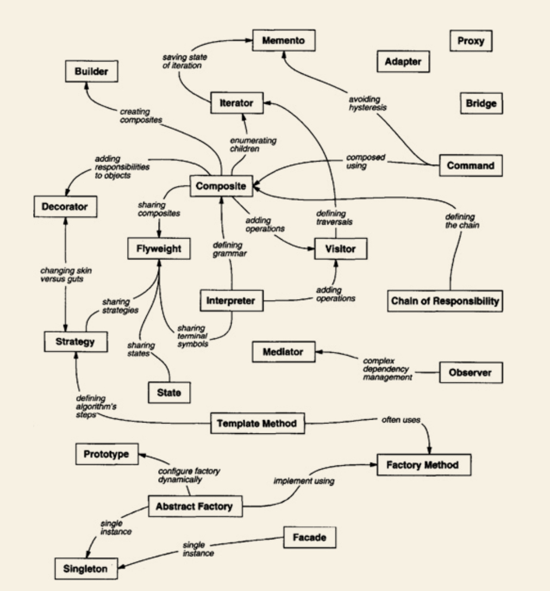

# Design Patterns 

My notes and example code for the book Design Patterns by Erich Gamma, John Vlissides, Richard Helm, and Ralph Johnson.

## What is a Design Pattern?
Any design pattern is a trend in object programming that crops up enough times to warrant its own classification. Recognizing these patterns makes code writing faster, and allows use of more flexible and reusable code.

## A Note About This Repo
It's complex. Each folder is chaotic and messy. This is because this repository is not a walkthrough, its my learning experience. 

It's also because THIS is what I'm trying to tackle:
